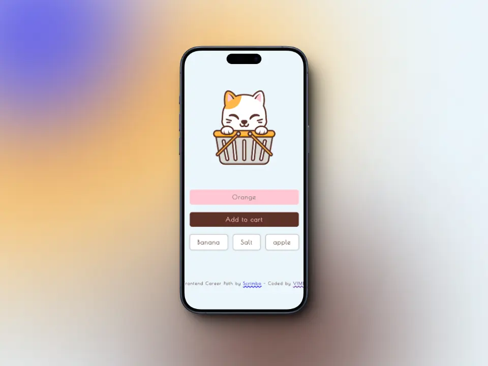

# Mobile App

Project carried out in class [**Frontend Career Path**](https://scrimba.com/learn/frontend) - Module 3.


### Table contents

+ [The goal](#the-goal)
+ [Screenshots](#screenshots)
+ [Links](#links)
+ [Built with](#built-with)
+ [What I learnt](#what-i-learnt)
+ [Useful resources](#useful-resources)
+ [Author](#author)

## *The goal*

🎯 Build an app that allows values to be entered and rendered in the app and stored in a real-time Firebase database. 

🎯 When a value is deleted, it is deleted from both the rendering and the database.

## *Screenshots*
### 📱 Mobile



### 💻 Desktop


## *Links*

[Live site](https://mendez-v.github.io/mobile-app/) 👀

[Scrim URL](https://scrimba.com/scrim/c7vGqbhV) 👀

[All my FCP projects](https://github.com/mendez-v/frontend-career-path) 👀

## *Built with*
📌 Mobile-first workflow

📌 HTML semantic

## *What I learnt*

🔰 `import` -  is used to import read-only live bindings which are exported by another module.

These two lines import specific functions from Firebase.
+ `initializeApp` is used to initialize a Firebase application.

+ `getDatabase`, `ref`, `push`, `onValue`, and `remove` are functions that interact with the Firebase real-time database.
```js
import { initializeApp } from "https://www.gstatic.com/firebasejs/9.15.0/firebase-app.js"
import { getDatabase, ref, push, onValue, remove } from "https://www.gstatic.com/firebasejs/9.15.0/firebase-database.js"
```

🔰 Application configuration - ***databaseURL*** is the URL of the Firebase real-time database.
```js
const appSettings = {
  databaseURL: "https://shopping-cart-34f59-default-rtdb.firebaseio.com/"
}
```

🔰 Initialises the Firebase application with the previously defined configuration.
```js
const app = initializeApp(appSettings)
```

🔰 Getting the database -
```js
const database = getDatabase(app)
```

🔰 Reference to shopping list - This reference can be used to read or write data to that location in the database.
```js
const shoppingListInDB = ref(database, "shoppingList")
```

🔰 Listening for database changes - `onValue` function listens for real-time changes in the database, it takes two arguments:

1. a reference to the database (in this case, ***shoppingListInDB***) and,

1. a callback function that is executed whenever the data in that reference changes. 
    1. ***snapshot*** is an object containing the current data in that reference.
```js
onValue(shoppingListInDB, function(snapshot) {
  // code
})
```

🔰 The `exists` function checks if there is any data in the snapshot. If there is data, the code inside the if block will be executed.
```js
if (snapshot.exists()) {
  // code
}
```

🔰 Converting the data into an array:
+ `snapshot.val()` returns the current data in snapshot as a JavaScript object. 

+ `Object.entries` converts this object into an array of arrays, where each subarray contains a ***key*** and a ***value*** from the original object.
```js
let itemsArr = Object.entries(snapshot.val())
```

🔰 Creating a reference to an item in the database:

+ The `ref` function creates a reference to a specific location in the Firebase database. In this case, the location is `shoppingList/${itemID}`, where 

+ `${itemID}` is a variable representing the ID of the item in the shopping list.

```js
let exactLocationOfItemInDB = ref(database, `shoppingList/${itemID}`)
```

🔰 Removing the item from the database:

+ `remove` function removes the data at the location specified by the reference. In this case, the shopping list item with the ***ID ${itemID}*** will be removed.

```js
remove(exactLocationOfItemInDB)
```

🔰 Web Manifest - is a JSON file that allows developers to control how their application behaves when installed on the user's desktop or mobile device. 

```json
{
  "name":"Shopping Cart",
  "short_name":"Shopping Cart",
  "start_url": "https://mendez-v.github.io/mobile-app/",
  "icons":[
    { 
      "src":"./assets/icon/android-chrome-192x192.png",
      "sizes":"192x192",
      "type":"image/png" 
    },
    { 
      "src":"./assets/icon/android-chrome-512x512.png",
      "sizes":"512x512",
      "type":"image/png" 
    }
  ],
  "theme_color":"#dad9d5",
  "background_color":"#dad9d5",
  "display":"standalone"
}
```

1. ***name***: This is the full name of your web application.

1. ***short_name***: This is the short name of your web application that will be displayed where space is limited, such as on the mobile device's home screen.

1. ***start_url***: This is the URL that will open when the user launches your web application from their device.

1. ***icons***: This is an array of objects that specifies the icons of your web application for different screen sizes and resolutions. Each object must have the properties `src` (the path to the icon), `sizes` (the size of the icon in pixels) and `type` (the file type of the icon).

1. ***theme_color***: This is the main colour of your web application. It is used in areas such as the device status bar. 

1. ***background_color***: This is the background colour of your web application. It is displayed while the web application is loading. 

1. ***display***: This is the preferred display mode for your web application. It can be `fullscreen`, `standalone`, `minimal-ui` or `browser`. 
    1. `standalone`, which means that your web application will open in its own window, separate from the browser.

## *Useful resources*

🔥 [Microsoft Copilot](https://copilot.microsoft.com/)

## *Author*

✨ Frontend Mentor - [@mendez-v](https://www.frontendmentor.io/profile/mendez-v)

